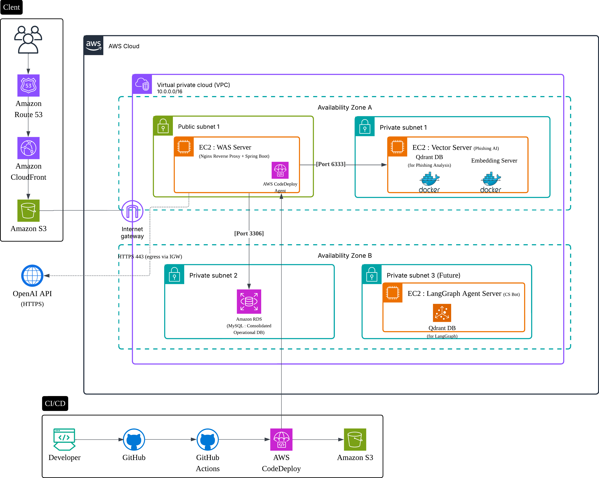

# CheatKey 시스템 아키텍처

## 1. 전체 시스템 아키텍처 개요

### 1.1 시스템 아키텍처 다이어그램

> Lucidchart로 작성된 AWS 클라우드 아키텍처 다이어그램.  
> VPC, EC2 인스턴스, RDS, CI/CD 파이프라인을 포함한 전체 시스템 구조를 시각적으로 보여줍니다.

---

### 1.2 주요 구성 요소

#### 클라이언트 접근
- **사용자**: Android/iOS 앱을 통한 접근
- **DNS & CDN**: Amazon Route 53 + CloudFront
- **정적 리소스**: Amazon S3

#### AWS 클라우드 인프라
- **VPC**: `10.0.0.0/16`
- **가용영역 (AZ)**: AZ A, AZ B
- **인터넷 게이트웨이**: 외부 트래픽 진입점

#### 네트워크 구성
- **Public Subnet 1 (AZ A)**: EC2: WAS 서버 (Nginx + Spring Boot)
- **Private Subnet 1 (AZ A)**: EC2: Vector 서버 (Phishing AI)
- **Private Subnet 2 (AZ B)**: EC2: LangChain Agent 서버 (CS Bot)
- **Private Subnet 4 (AZ B)**: Amazon RDS (MySQL)

---

## 2. 서버 구성 상세

### 2.1 EC2: WAS 서버 (Public Subnet 1)
- **역할**: Nginx Reverse Proxy + Spring Boot
- **포트**: 80, 443
- **기능**:
  - 클라이언트 요청 처리
  - API 라우팅
  - AWS CodeDeploy Agent 설치
- **통신**:
  - Vector 서버 (Port 6333)
  - LangChain Agent 서버 (Port 8080)

---

### 2.2 EC2: Vector 서버 (Private Subnet 1)
- **역할**: 피싱 사례 AI 분석
- **구성**:
  - Docker 컨테이너 환경
    - Qdrant DB (for Phishing Analysis)
    - Embedding Server
- **비고**:
  - RDS와 직접 통신하지 않음

---

### 2.3 EC2: LangChain Agent 서버 (Private Subnet 2)
- **역할**: CS Bot 처리 서버
- **포트**: 8080 (내부 호출 전용)
- **구성**:
  - Qdrant DB (for LangChain)
  - GPT API 연동
- **통신**:
  - RDS (Port 3306)
  - 외부 GPT API (HTTPS)

---

### 2.4 Amazon RDS (Private Subnet 4)
- **역할**: 관계형 데이터베이스 (MySQL)
- **접근**: LangChain Agent 서버에서만 접근
- **포트**: 3306

---

## 3. 외부 API 통합

### 3.1 GPT API (HTTPS)
- **요청 주체**: LangChain Agent 서버
- **용도**: CS Bot 자연어 처리 (GPT 기반)
- **통신 방식**: Outbound HTTPS via IGW or NAT

---

## 4. CI/CD 파이프라인

### 4.1 배포 프로세스
- **개발자**: 코드 수정 및 GitHub 푸시
- **GitHub**: 소스 코드 저장소
- **GitHub Actions**: 자동 빌드 및 테스트
- **AWS CodeDeploy**: 배포 서비스
- **EC2 WAS 서버**: CodeDeploy Agent 설치됨

### 4.2 배포 아티팩트
- **Amazon S3**: CodeDeploy 배포 파일 저장소

---

## 5. 보안 구성

### 5.1 네트워크 보안
- **VPC**: 프라이빗 네트워크
- **Security Groups**: 포트별 접근 제어
- **Private Subnets**: AI 서버 및 DB 보호

### 5.2 애플리케이션 보안
- **JWT 토큰**: API 기반 사용자 인증
- **OAuth**: Kakao, Apple 소셜 로그인 (Native SDK 기반)
- **HTTPS**: 모든 외부 통신 암호화

---

## 6. 데이터 플로우

### 6.1 일반 요청 흐름
- Client → Route 53 → CloudFront → S3
- S3 → IGW → EC2 WAS Server
- WAS Server → Vector Server (Port 6333)

### 6.2 CS Bot 요청 흐름
- Client → IGW → LangChain Agent Server (Port 8080)
- LangChain Agent → RDS (Port 3306)
- LangChain Agent → Qdrant (Local)
- LangChain Agent → GPT API (HTTPS)

---

## 7. 확장성 및 고가용성

### 7.1 다중 가용영역 구성
- **AZ A**: WAS 서버, Vector 서버
- **AZ B**: LangChain Agent 서버, RDS
- **RDS**: Multi-AZ 설정

### 7.2 자동 확장 구성 (설계 고려)
- Auto Scaling Groups
- Application Load Balancer (ALB)
- RDS Read Replicas

---

## 8. 모니터링 및 운영

### 8.1 AWS 모니터링
- **CloudWatch**: 지표 수집
- **CloudWatch Logs**: 애플리케이션 로그
- **CloudWatch Alarms**: 이상 징후 알림

### 8.2 운영 도구
- **LangGraph**: CS 자동화
- **MCP**: 실시간 인프라 모니터링
- **Jira**: 이슈 관리

---

## 9. 기술 스택

### 9.1 백엔드
- Spring Boot
- FastAPI (Embedding Server)
- Nginx (Reverse Proxy)

### 9.2 데이터베이스
- MySQL (RDS)
- Qdrant (Vector DB)

### 9.3 AI/ML
- KoSimCSE (임베딩 모델)
- GPT API (LLM 기반 자연어 처리)

### 9.4 인프라
- AWS EC2 / RDS / S3 / CloudFront / Route 53

---

## 📌 요약

이 아키텍처는 확장 가능하고 안전한 AWS 기반 클라우드 시스템으로,  
**피싱 탐지 AI 분석**과 **CS 자동화 기능**을 제공하는 CheatKey 서비스의 핵심 인프라입니다.
