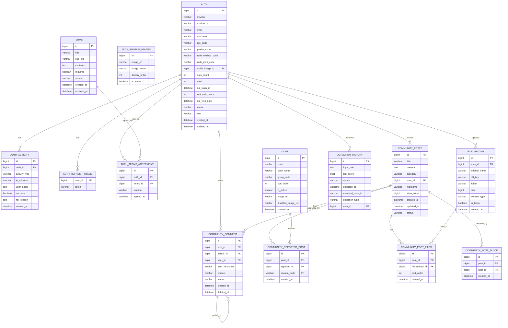

# CheatKey ERD (Entity Relationship Diagram)

## 1. 전체 ERD 구조



## 2. 테이블별 상세 스키마

### 2.1 인증 관련 테이블

#### t_auth (사용자 인증 정보)
```sql
CREATE TABLE t_auth (
    id BIGINT PRIMARY KEY AUTO_INCREMENT,
    provider VARCHAR(20) NOT NULL,                    -- KAKAO, APPLE
    provider_id VARCHAR(255) NOT NULL,                -- 소셜 제공자 ID
    email VARCHAR(255),                               -- 이메일
    nickname VARCHAR(50),                             -- 닉네임
    age_code VARCHAR(10),                             -- 연령대 코드
    gender_code VARCHAR(10),                          -- 성별 코드
    trade_method_code VARCHAR(10),                    -- 거래방법 코드
    trade_item_code VARCHAR(10),                      -- 거래물품 코드
    profile_image_id BIGINT,                          -- 프로필 이미지 ID
    login_count INT DEFAULT 0,                        -- 로그인 횟수
    level INT DEFAULT 1,                              -- 사용자 레벨
    last_login_at DATETIME,                           -- 마지막 로그인 시간
    total_visit_count INT DEFAULT 0,                  -- 총 방문 횟수
    last_visit_date DATETIME,                         -- 마지막 방문 날짜
    status VARCHAR(20) DEFAULT 'PENDING',             -- PENDING, ACTIVE, WITHDRAWN
    role VARCHAR(20) DEFAULT 'USER',                  -- USER, ADMIN
    created_at DATETIME DEFAULT CURRENT_TIMESTAMP,
    updated_at DATETIME DEFAULT CURRENT_TIMESTAMP ON UPDATE CURRENT_TIMESTAMP,
    
    UNIQUE KEY uk_provider_provider_id (provider, provider_id),
    INDEX idx_email (email),
    INDEX idx_nickname (nickname)
);
```

#### t_auth_activity (사용자 활동 기록)
```sql
CREATE TABLE t_auth_activity (
    id BIGINT PRIMARY KEY AUTO_INCREMENT,
    auth_id BIGINT NOT NULL,
    activity_type VARCHAR(50) NOT NULL,               -- SOCIAL_LOGIN, TOKEN_REFRESH, HOME_VISIT, MYPAGE_VISIT
    ip_address VARCHAR(45),                           -- IP 주소
    user_agent TEXT,                                  -- User Agent
    success BOOLEAN DEFAULT TRUE,                     -- 성공 여부
    fail_reason TEXT,                                 -- 실패 사유
    created_at DATETIME DEFAULT CURRENT_TIMESTAMP,
    
    FOREIGN KEY (auth_id) REFERENCES t_auth(id) ON DELETE CASCADE,
    INDEX idx_auth_id (auth_id),
    INDEX idx_activity_type (activity_type),
    INDEX idx_created_at (created_at)
);
```

#### t_auth_refresh_token (리프레시 토큰)
```sql
CREATE TABLE t_auth_refresh_token (
    user_id BIGINT PRIMARY KEY,
    token VARCHAR(500) NOT NULL UNIQUE,
    
    FOREIGN KEY (user_id) REFERENCES t_auth(id) ON DELETE CASCADE
);
```

#### t_auth_profile_images (프로필 이미지)
```sql
CREATE TABLE t_auth_profile_images (
    id BIGINT PRIMARY KEY AUTO_INCREMENT,
    image_url VARCHAR(500),
    image_name VARCHAR(255),
    display_order INT DEFAULT 0,
    is_active BOOLEAN DEFAULT TRUE
);
```

### 2.2 약관 관련 테이블

#### t_terms (약관 정보)
```sql
CREATE TABLE t_terms (
    id BIGINT PRIMARY KEY AUTO_INCREMENT,
    title VARCHAR(255) NOT NULL,
    sub_title VARCHAR(255),
    contents TEXT NOT NULL,
    required BOOLEAN DEFAULT FALSE,
    version VARCHAR(20),
    created_at DATETIME DEFAULT CURRENT_TIMESTAMP,
    updated_at DATETIME DEFAULT CURRENT_TIMESTAMP ON UPDATE CURRENT_TIMESTAMP,
    
    INDEX idx_version (version),
    INDEX idx_required (required)
);
```

#### t_auth_terms_agreement (약관 동의 기록)
```sql
CREATE TABLE t_auth_terms_agreement (
    id BIGINT PRIMARY KEY AUTO_INCREMENT,
    auth_id BIGINT NOT NULL,
    terms_id BIGINT NOT NULL,
    version VARCHAR(20),
    agreed_at DATETIME DEFAULT CURRENT_TIMESTAMP,
    
    FOREIGN KEY (auth_id) REFERENCES t_auth(id) ON DELETE CASCADE,
    FOREIGN KEY (terms_id) REFERENCES t_terms(id) ON DELETE CASCADE,
    UNIQUE KEY uk_auth_terms (auth_id, terms_id),
    INDEX idx_auth_id (auth_id),
    INDEX idx_terms_id (terms_id)
);
```

### 2.3 코드 관리 테이블

#### t_code (코드 관리)
```sql
CREATE TABLE t_code (
    id BIGINT PRIMARY KEY AUTO_INCREMENT,
    code VARCHAR(50) NOT NULL,
    code_name VARCHAR(100) NOT NULL,
    group_code VARCHAR(50) NOT NULL,                  -- CODE_TYPE enum
    sort_order INT DEFAULT 0,
    is_active BOOLEAN DEFAULT TRUE,
    image_url VARCHAR(500),
    disabled_image_url VARCHAR(500),
    created_at DATETIME DEFAULT CURRENT_TIMESTAMP,
    
    UNIQUE KEY uk_code (code),
    INDEX idx_group_code (group_code),
    INDEX idx_sort_order (sort_order)
);
```

### 2.4 커뮤니티 관련 테이블

#### t_community_posts (커뮤니티 게시글)
```sql
CREATE TABLE t_community_posts (
    id BIGINT PRIMARY KEY AUTO_INCREMENT,
    title VARCHAR(255) NOT NULL,
    content TEXT NOT NULL,
    category VARCHAR(50) NOT NULL,                    -- COMMUNITY_CATEGORY enum
    user_id BIGINT NOT NULL,
    nickname VARCHAR(50) NOT NULL,
    view_count BIGINT DEFAULT 0,
    created_at DATETIME DEFAULT CURRENT_TIMESTAMP,
    updated_at DATETIME DEFAULT CURRENT_TIMESTAMP ON UPDATE CURRENT_TIMESTAMP,
    status VARCHAR(20) DEFAULT 'ACTIVE',              -- ACTIVE, DELETED, REPORTED
    
    FOREIGN KEY (user_id) REFERENCES t_auth(id) ON DELETE CASCADE,
    INDEX idx_user_id (user_id),
    INDEX idx_category (category),
    INDEX idx_status (status),
    INDEX idx_created_at (created_at)
);
```

#### t_community_comment (커뮤니티 댓글)
```sql
CREATE TABLE t_community_comment (
    id BIGINT PRIMARY KEY AUTO_INCREMENT,
    post_id BIGINT NOT NULL,
    parent_id BIGINT,                                 -- 대댓글인 경우 부모 댓글 ID
    user_id BIGINT NOT NULL,
    user_nickname VARCHAR(50) NOT NULL,
    content VARCHAR(200) NOT NULL,
    status VARCHAR(10) DEFAULT 'ACTIVE',              -- ACTIVE, DELETED
    created_at DATETIME DEFAULT CURRENT_TIMESTAMP,
    deleted_at DATETIME,
    
    FOREIGN KEY (post_id) REFERENCES t_community_posts(id) ON DELETE CASCADE,
    FOREIGN KEY (parent_id) REFERENCES t_community_comment(id) ON DELETE CASCADE,
    FOREIGN KEY (user_id) REFERENCES t_auth(id) ON DELETE CASCADE,
    INDEX idx_post_id (post_id),
    INDEX idx_parent_id (parent_id),
    INDEX idx_user_id (user_id),
    INDEX idx_status (status)
);
```

#### t_community_reported_post (신고된 게시글)
```sql
CREATE TABLE t_community_reported_post (
    id BIGINT PRIMARY KEY AUTO_INCREMENT,
    post_id BIGINT NOT NULL,
    reporter_id BIGINT NOT NULL,
    reason_code VARCHAR(50) NOT NULL,                 -- t_code.code 참조
    created_at DATETIME DEFAULT CURRENT_TIMESTAMP,
    
    FOREIGN KEY (post_id) REFERENCES t_community_posts(id) ON DELETE CASCADE,
    FOREIGN KEY (reporter_id) REFERENCES t_auth(id) ON DELETE CASCADE,
    FOREIGN KEY (reason_code) REFERENCES t_code(code),
    INDEX idx_post_id (post_id),
    INDEX idx_reporter_id (reporter_id),
    INDEX idx_reason_code (reason_code)
);
```

#### t_community_post_files (게시글 첨부파일)
```sql
CREATE TABLE t_community_post_files (
    id BIGINT PRIMARY KEY AUTO_INCREMENT,
    post_id BIGINT NOT NULL,
    file_upload_id BIGINT NOT NULL,
    sort_order INT DEFAULT 0,
    created_at DATETIME DEFAULT CURRENT_TIMESTAMP,
    
    FOREIGN KEY (post_id) REFERENCES t_community_posts(id) ON DELETE CASCADE,
    FOREIGN KEY (file_upload_id) REFERENCES t_file_upload(id) ON DELETE CASCADE,
    INDEX idx_post_id (post_id),
    INDEX idx_sort_order (sort_order)
);
```

#### t_community_post_block (게시글 차단)
```sql
CREATE TABLE t_community_post_block (
    id BIGINT PRIMARY KEY AUTO_INCREMENT,
    post_id BIGINT NOT NULL,
    user_id BIGINT NOT NULL,
    created_at DATETIME DEFAULT CURRENT_TIMESTAMP,
    
    FOREIGN KEY (post_id) REFERENCES t_community_posts(id) ON DELETE CASCADE,
    FOREIGN KEY (user_id) REFERENCES t_auth(id) ON DELETE CASCADE,
    UNIQUE KEY uk_post_user (post_id, user_id),
    INDEX idx_post_id (post_id),
    INDEX idx_user_id (user_id)
);
```

### 2.5 사기 탐지 관련 테이블

#### t_detection_history (탐지 기록)
```sql
CREATE TABLE t_detection_history (
    id BIGINT PRIMARY KEY AUTO_INCREMENT,
    input_text TEXT NOT NULL,
    top_score FLOAT NOT NULL,
    status VARCHAR(20) NOT NULL,                      -- DETECTION_STATUS enum
    detected_at DATETIME DEFAULT CURRENT_TIMESTAMP,
    matched_case_id VARCHAR(255),                     -- Qdrant 검색 결과 Top1의 ID
    detection_type VARCHAR(50),                       -- DETECTION_TYPE enum
    user_id BIGINT,
    
    FOREIGN KEY (user_id) REFERENCES t_auth(id) ON DELETE SET NULL,
    INDEX idx_user_id (user_id),
    INDEX idx_status (status),
    INDEX idx_detection_type (detection_type),
    INDEX idx_detected_at (detected_at)
);
```


### 2.6 파일 업로드 테이블

#### t_file_upload (파일 업로드)
```sql
CREATE TABLE t_file_upload (
    id BIGINT PRIMARY KEY AUTO_INCREMENT,
    user_id BIGINT NOT NULL,
    original_name VARCHAR(255) NOT NULL,
    s3_key VARCHAR(500) NOT NULL,
    folder VARCHAR(50) NOT NULL,                      -- FILE_FOLDER enum
    size BIGINT NOT NULL,
    content_type VARCHAR(100) NOT NULL,
    is_temp BOOLEAN DEFAULT TRUE,
    created_at DATETIME DEFAULT CURRENT_TIMESTAMP,
    
    FOREIGN KEY (user_id) REFERENCES t_auth(id) ON DELETE CASCADE,
    INDEX idx_user_id (user_id),
    INDEX idx_folder (folder),
    INDEX idx_is_temp (is_temp),
    INDEX idx_created_at (created_at)
);
```

## 3. 인덱스 전략

### 3.1 주요 인덱스
- **t_auth**: provider + provider_id (복합 유니크), email, nickname
- **t_auth_activity**: auth_id, activity_type, created_at
- **t_community_posts**: user_id, category, status, created_at
- **t_community_comment**: post_id, parent_id, user_id, status
- **t_detection_history**: user_id, status, detection_type, detected_at
- **t_file_upload**: user_id, folder, is_temp, created_at

### 3.2 성능 최적화
- **복합 인덱스**: 자주 함께 조회되는 컬럼들
- **부분 인덱스**: is_active = true인 레코드만 인덱싱
- **커버링 인덱스**: SELECT 절의 모든 컬럼을 포함하는 인덱스

## 4. 데이터 무결성 제약조건

### 4.1 외래키 제약조건
- 모든 FK는 CASCADE 또는 SET NULL로 설정
- 중복 방지를 위한 UNIQUE 제약조건
- NOT NULL 제약조건으로 필수 데이터 보장

### 4.2 체크 제약조건
- 상태값은 미리 정의된 enum 값만 허용
- 숫자 필드는 양수 값만 허용
- 날짜 필드는 과거 날짜만 허용

## 5. 데이터 마이그레이션 전략

### 5.1 스키마 변경
- 새로운 컬럼 추가 시 기본값 설정
- 기존 데이터 보존을 위한 단계적 마이그레이션
- 롤백 가능한 마이그레이션 스크립트

### 5.2 데이터 정합성
- 외래키 참조 무결성 검증
- 중복 데이터 제거
- 불필요한 데이터 정리

## 6. 백업 및 복구 전략

### 6.1 백업 전략
- **전체 백업**: 일일 전체 백업
- **증분 백업**: 시간별 증분 백업
- **로그 백업**: 실시간 트랜잭션 로그 백업

### 6.2 복구 전략
- **Point-in-Time Recovery**: 특정 시점으로 복구
- **장애 복구**: RTO/RPO 목표 달성
- **데이터 검증**: 복구 후 데이터 무결성 검증 