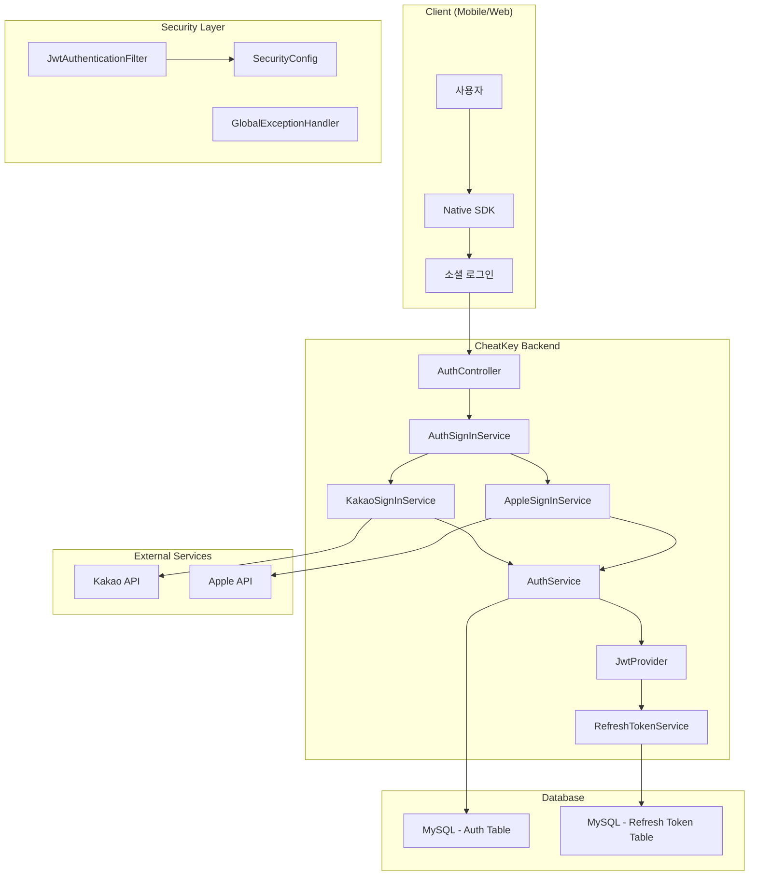
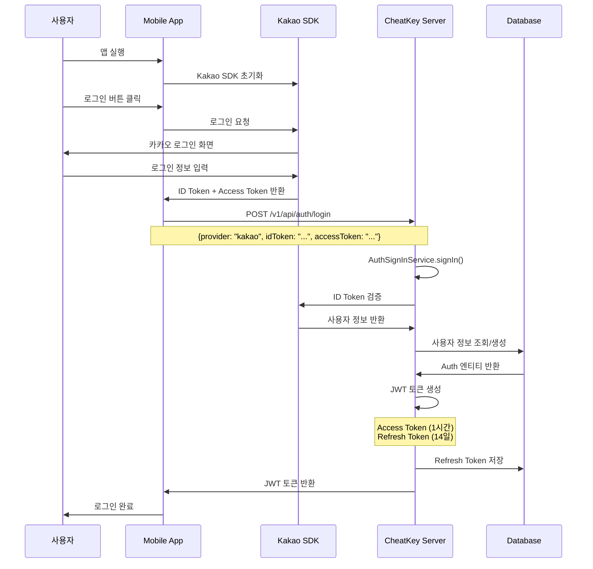
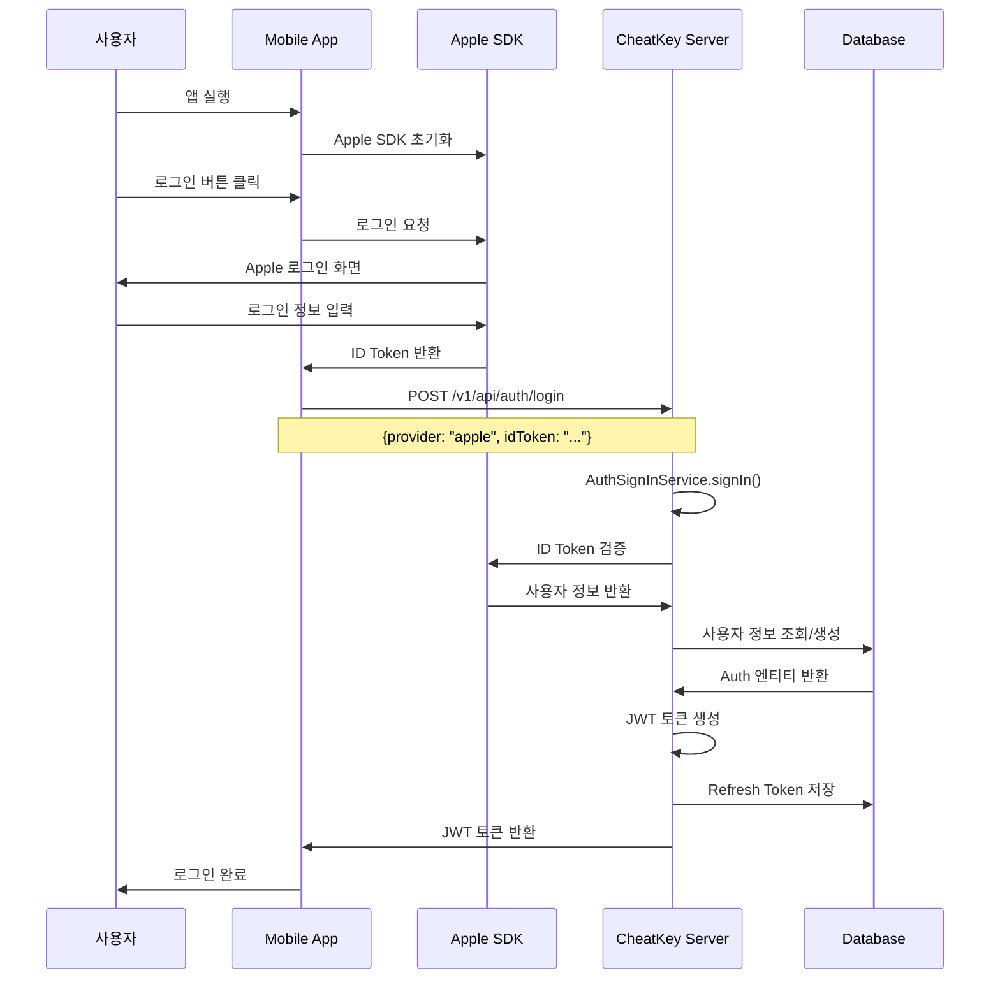
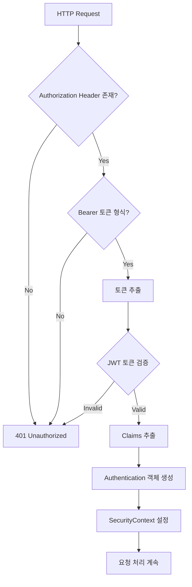
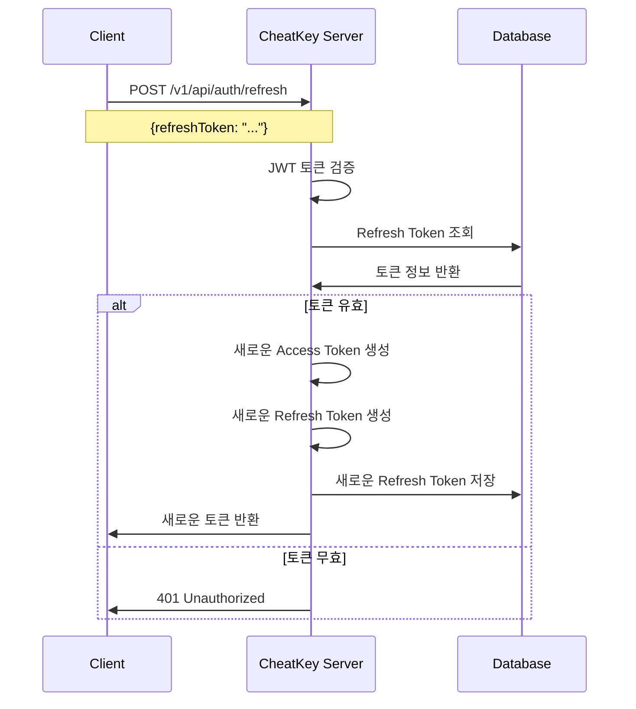
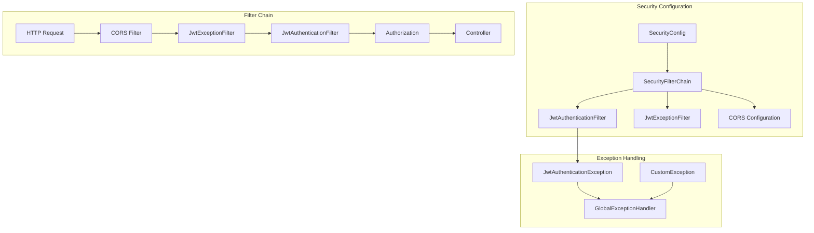
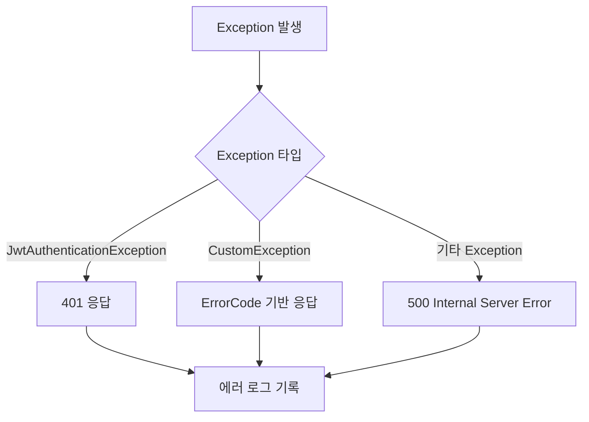

# 인증 시스템 구조도

## 1. 전체 인증 아키텍처



## 2. 소셜 로그인 흐름도

### 2.1 Kakao 로그인 흐름



### 2.2 Apple 로그인 흐름



## 3. JWT 토큰 구조 및 흐름

### 3.1 JWT 토큰 구조

#### Access Token
```json
{
  "header": {
    "alg": "HS256",
    "typ": "JWT"
  },
  "payload": {
    "sub": "123",           // 사용자 ID
    "provider": "KAKAO",    // 소셜 제공자
    "role": "ROLE_USER",    // 사용자 권한
    "iat": 1640995200,      // 발급 시간
    "exp": 1640998800       // 만료 시간 (1시간)
  },
  "signature": "HMACSHA256(...)"
}
```

#### Refresh Token
```json
{
  "header": {
    "alg": "HS256",
    "typ": "JWT"
  },
  "payload": {
    "sub": "123",           // 사용자 ID
    "iat": 1640995200,      // 발급 시간
    "exp": 1641600000       // 만료 시간 (14일)
  },
  "signature": "HMACSHA256(...)"
}
```

### 3.2 JWT 인증 필터 흐름



### 3.3 토큰 갱신 흐름



## 4. 보안 설정 구조

### 4.1 Spring Security 설정



### 4.2 인증/인가 흐름

```mermaid
flowchart TD
    A[API 요청] --> B{인증 필요?}
    B -->|No| C[요청 처리]
    B -->|Yes| D{JWT 토큰 존재?}
    D -->|No| E[401 Unauthorized]
    D -->|Yes| F{토큰 유효?}
    F -->|No| E
    F -->|Yes| G{권한 확인}
    G -->|No| H[403 Forbidden]
    G -->|Yes| C
```



## 5. 에러 처리 구조

### 5.1 인증 관련 에러 코드

| 에러 코드 | 설명 | HTTP 상태 |
|-----------|------|-----------|
| `INVALID_TOKEN` | 유효하지 않은 토큰 | 401 |
| `EXPIRED_TOKEN` | 만료된 토큰 | 401 |
| `INVALID_PROVIDER` | 잘못된 소셜 제공자 | 400 |
| `AUTH_UNAUTHORIZED` | 인증 실패 | 401 |
| `DUPLICATE_NICKNAME` | 중복된 닉네임 | 409 |

### 5.2 예외 처리 흐름



## 6. 데이터베이스 스키마

### 6.1 인증 관련 테이블

#### Auth 테이블
```sql
CREATE TABLE t_auth (
    id BIGINT PRIMARY KEY AUTO_INCREMENT,
    provider VARCHAR(20) NOT NULL,           -- KAKAO, APPLE
    provider_id VARCHAR(255) NOT NULL,       -- 소셜 제공자 ID
    email VARCHAR(255),                      -- 이메일
    nickname VARCHAR(50),                    -- 닉네임
    status VARCHAR(20) DEFAULT 'PENDING',    -- PENDING, ACTIVE, WITHDRAWN
    role VARCHAR(20) DEFAULT 'USER',         -- USER, ADMIN
    created_at TIMESTAMP DEFAULT CURRENT_TIMESTAMP,
    updated_at TIMESTAMP DEFAULT CURRENT_TIMESTAMP ON UPDATE CURRENT_TIMESTAMP
);
```

#### AuthActivity 테이블
```sql
CREATE TABLE t_auth_activity (
    id BIGINT PRIMARY KEY AUTO_INCREMENT,
    auth_id BIGINT NOT NULL,
    activity_type VARCHAR(50) NOT NULL,      -- SOCIAL_LOGIN, LOGOUT, WITHDRAW
    ip_address VARCHAR(45),                  -- IP 주소
    user_agent TEXT,                         -- User Agent
    success BOOLEAN DEFAULT TRUE,            -- 성공 여부
    fail_reason TEXT,                        -- 실패 사유
    created_at TIMESTAMP DEFAULT CURRENT_TIMESTAMP
);
```

## 7. 모니터링 및 로깅

### 7.1 로그 레벨 설정
```yaml
logging:
  level:
    org.springframework.security: DEBUG
    com.cheatkey.common.jwt: DEBUG
    com.cheatkey.module.auth: DEBUG
```

### 7.2 주요 로그 포인트
- 소셜 로그인 시도/성공/실패
- JWT 토큰 생성/검증
- 토큰 갱신 시도/성공/실패
- 인증 실패 (401, 403)
- 사용자 활동 기록

## 8. 성능 최적화

### 8.1 토큰 검증 최적화
- JWT 토큰 검증을 필터 레벨에서 처리
- MySQL을 통한 Refresh Token 관리
- 토큰 블랙리스트 관리

### 8.2 캐싱 전략
- 사용자 정보 캐싱
- 소셜 제공자 토큰 검증 결과 캐싱
- 권한 정보 캐싱

## 9. 보안 고려사항

### 9.1 토큰 보안
- JWT Secret Key 안전한 관리
- 토큰 만료 시간 적절히 설정
- Refresh Token Rotation 구현
- 토큰 탈취 시 무효화 메커니즘

### 9.2 입력 검증
- 소셜 토큰 검증
- 사용자 입력 데이터 검증
- XSS 방지
- SQL Injection 방지

### 9.3 네트워크 보안
- HTTPS 사용
- CORS 설정
- Rate Limiting
- IP 기반 접근 제한 