# 비즈니스 플로우 차트

## 1. 사용자 온보딩 플로우

### 1.1 소셜 로그인 및 회원가입 플로우

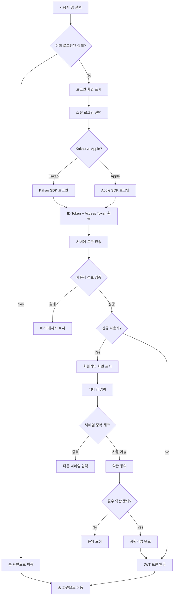

### 1.2 약관 동의 플로우

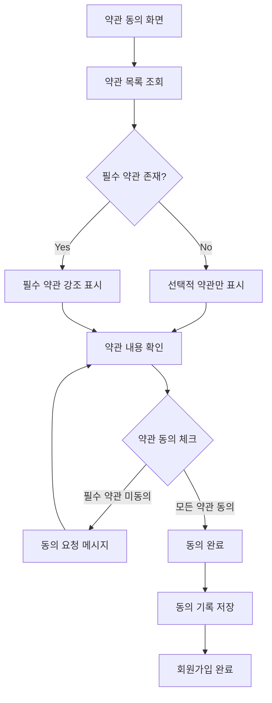

## 2. 사기 탐지 의사결정 플로우

### 2.1 텍스트 기반 사기 탐지 플로우 (Graph-based State Machine)

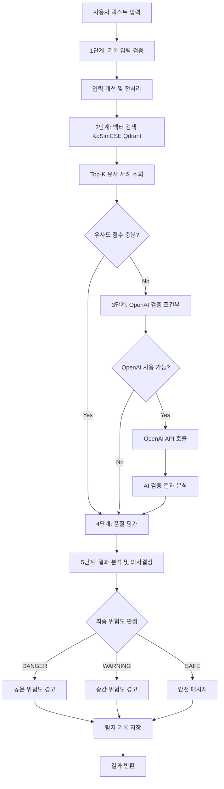

### 2.2 URL 탐지 플로우

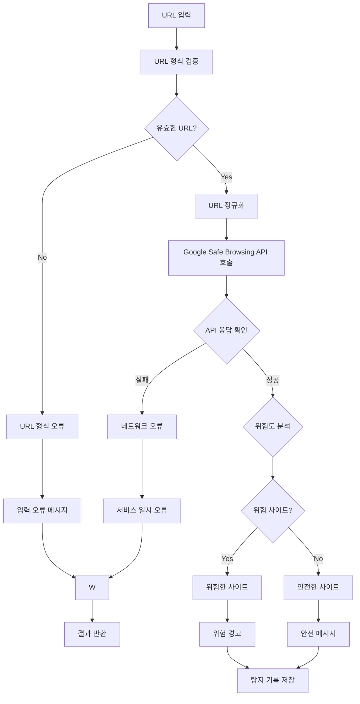

## 3. 커뮤니티 모더레이션 플로우

### 3.1 게시글 작성 및 검증 플로우

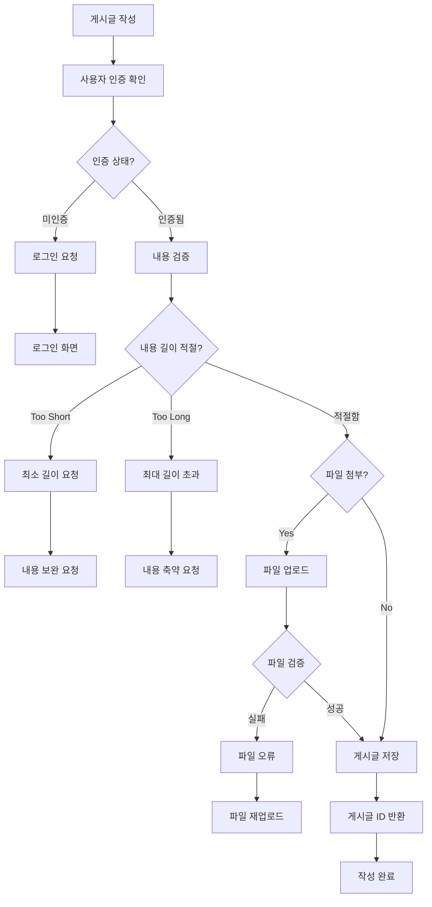

### 3.2 신고 처리 플로우

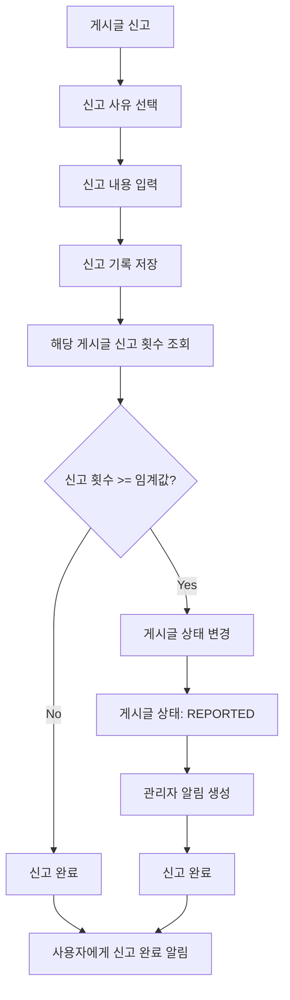

### 3.3 댓글 계층 구조 플로우

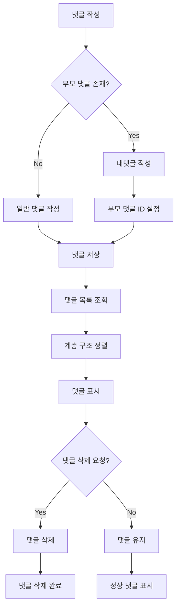

## 4. 파일 관리 플로우

### 4.1 파일 업로드 검증 플로우

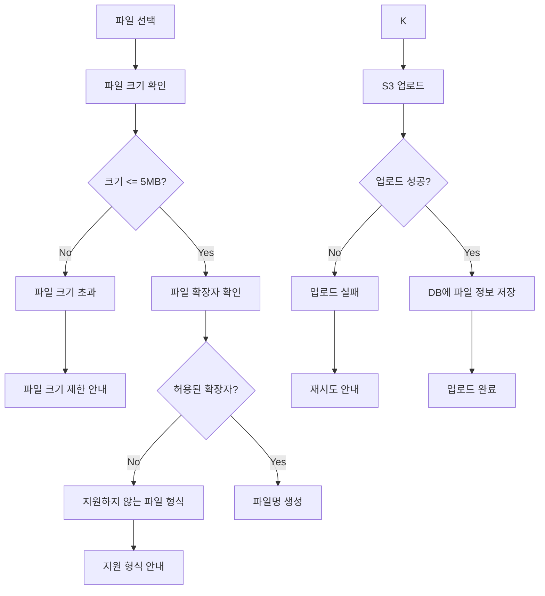

### 4.2 파일 다운로드 플로우

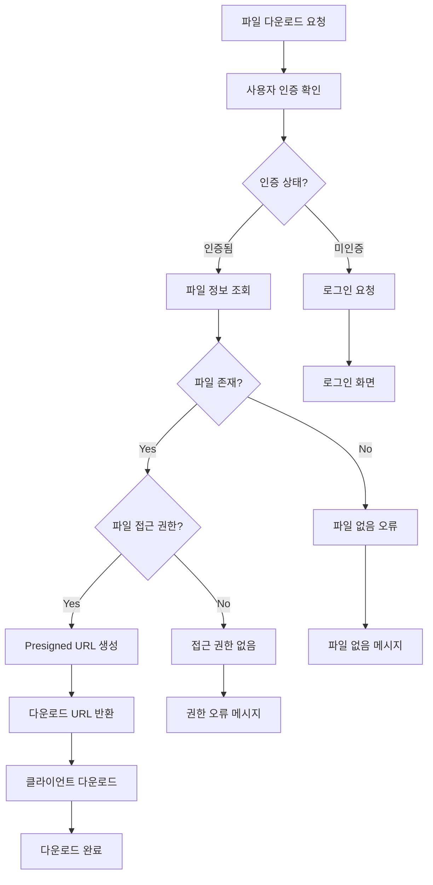

## 5. 사용자 활동 추적 플로우

### 5.1 방문 기록 플로우

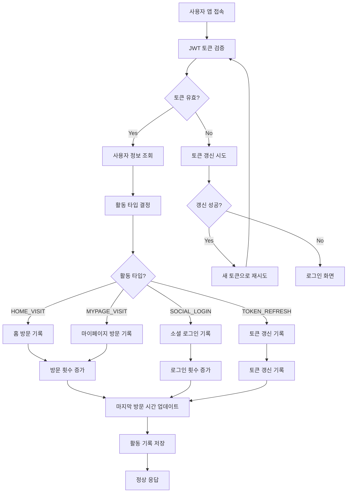

## 6. 에러 처리 플로우

### 6.1 토큰 만료 처리 플로우

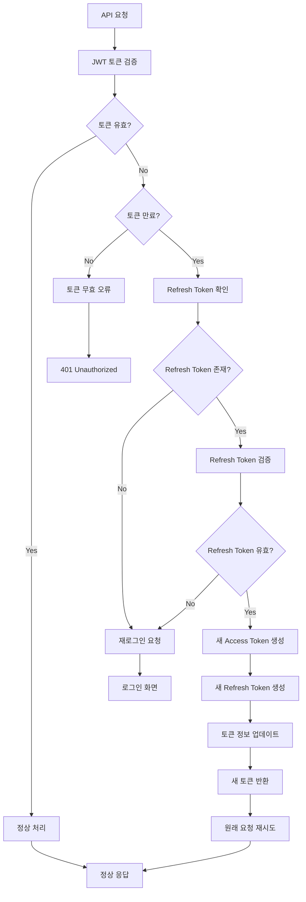

### 6.2 예외 처리 플로우

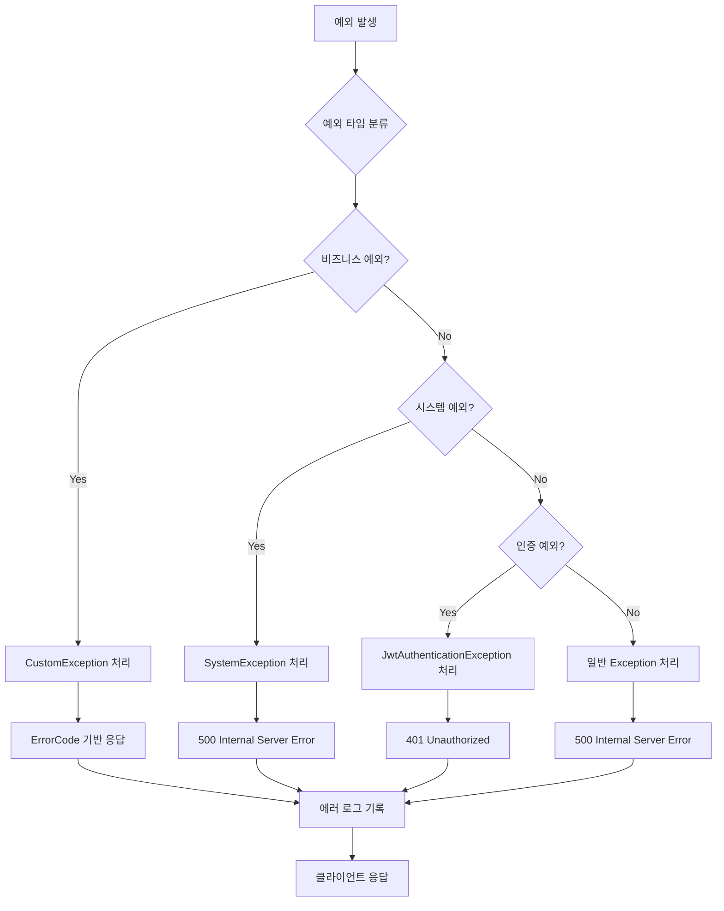