# 기술적 시퀀스 다이어그램

## 1. 사기 탐지 시퀀스

### 1.1 텍스트 기반 사기 탐지

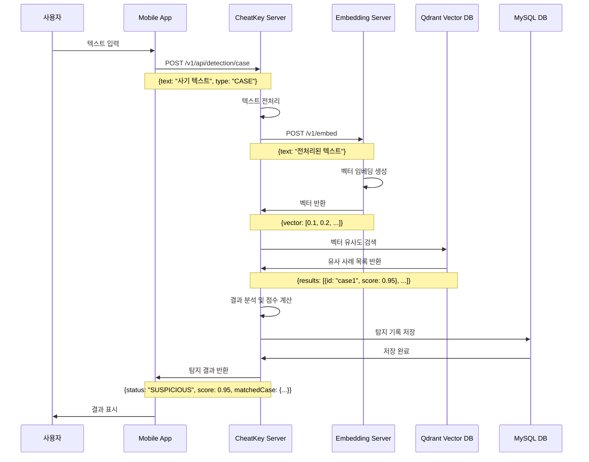

### 1.2 URL 기반 사기 탐지

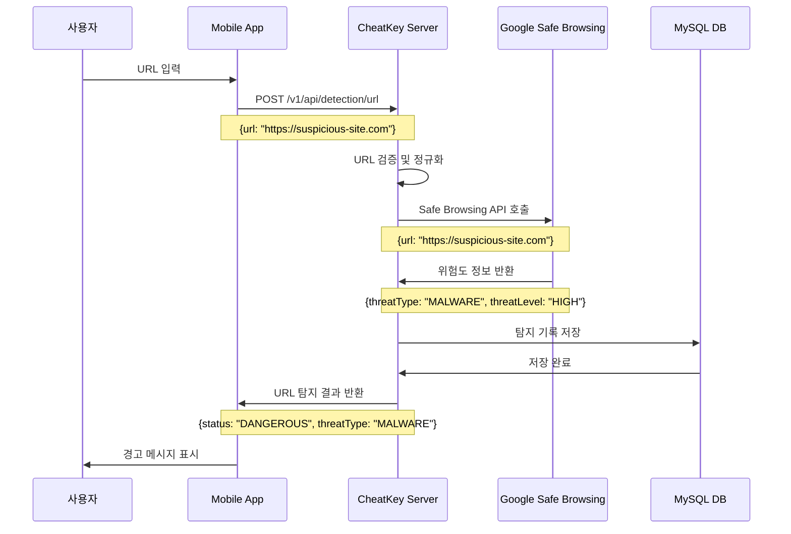

## 2. 커뮤니티 시퀀스

### 2.1 게시글 작성 및 조회

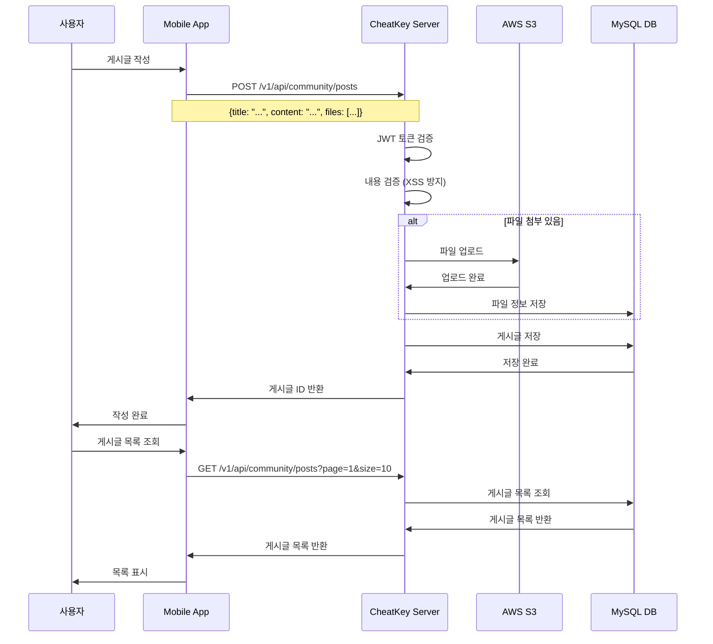

### 2.2 댓글 작성 및 계층형 구조

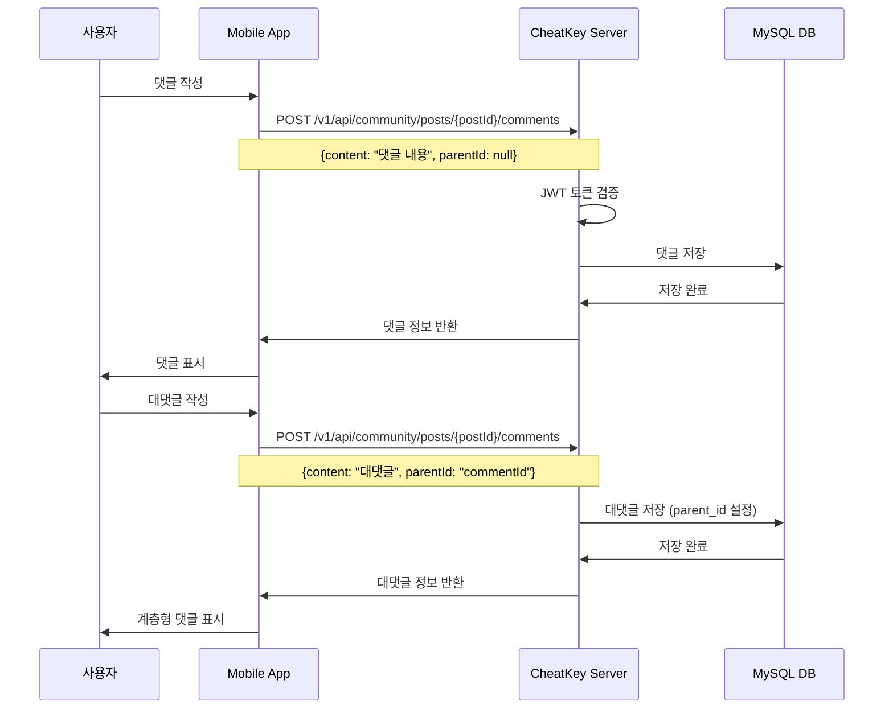

### 2.3 게시글 신고 처리

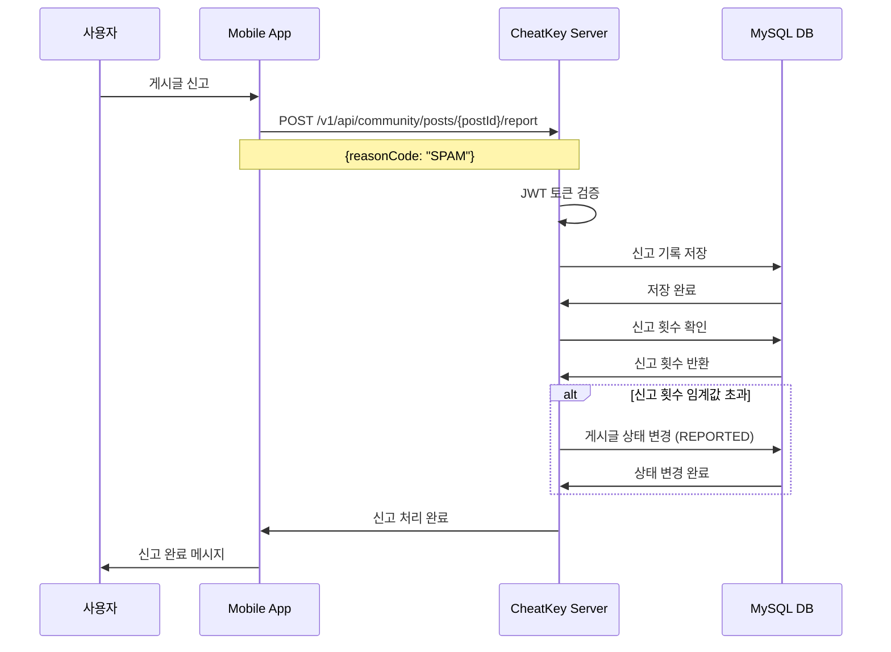

## 3. 파일 업로드 시퀀스

### 3.1 파일 업로드 프로세스

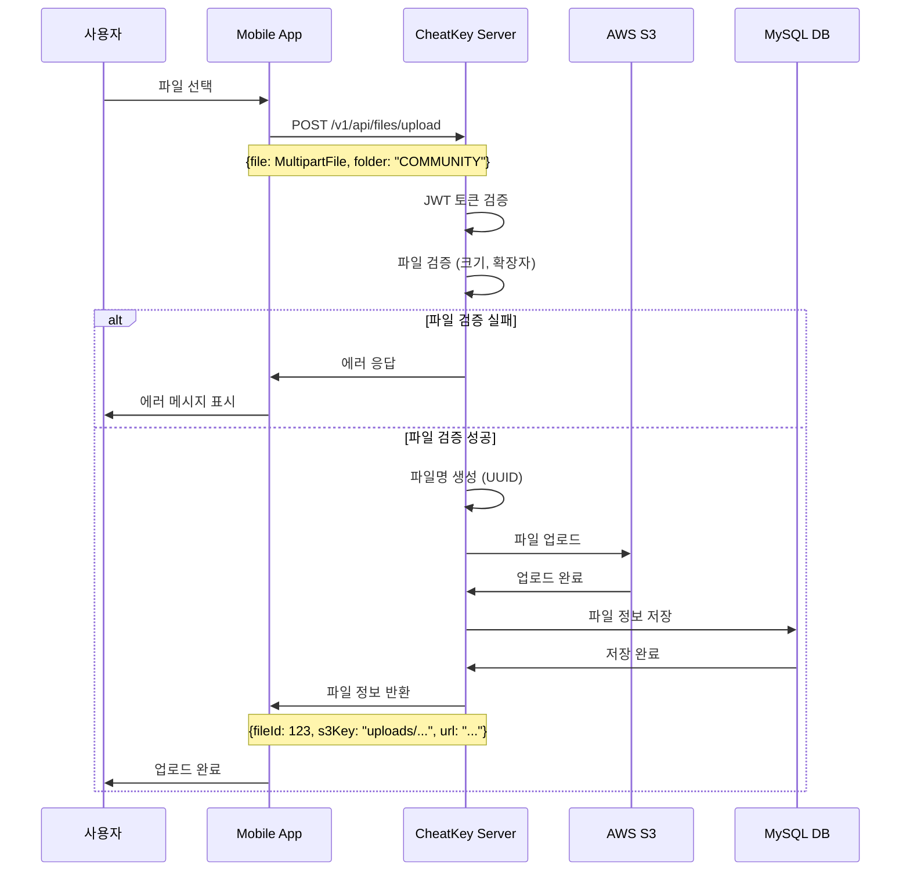

### 3.2 파일 다운로드 프로세스

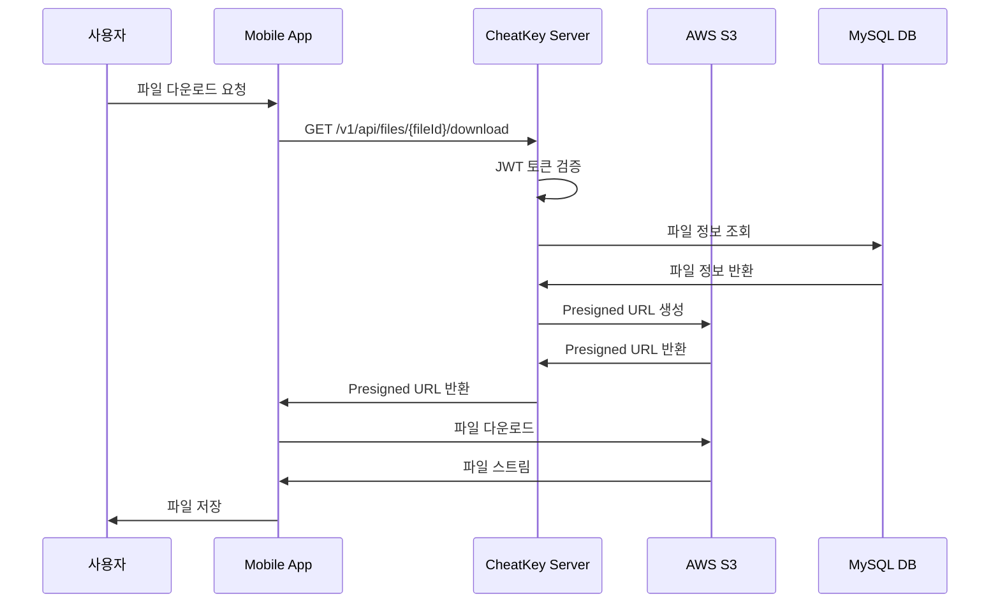

## 4. 사용자 활동 추적 시퀀스

### 4.1 홈 대시보드 방문

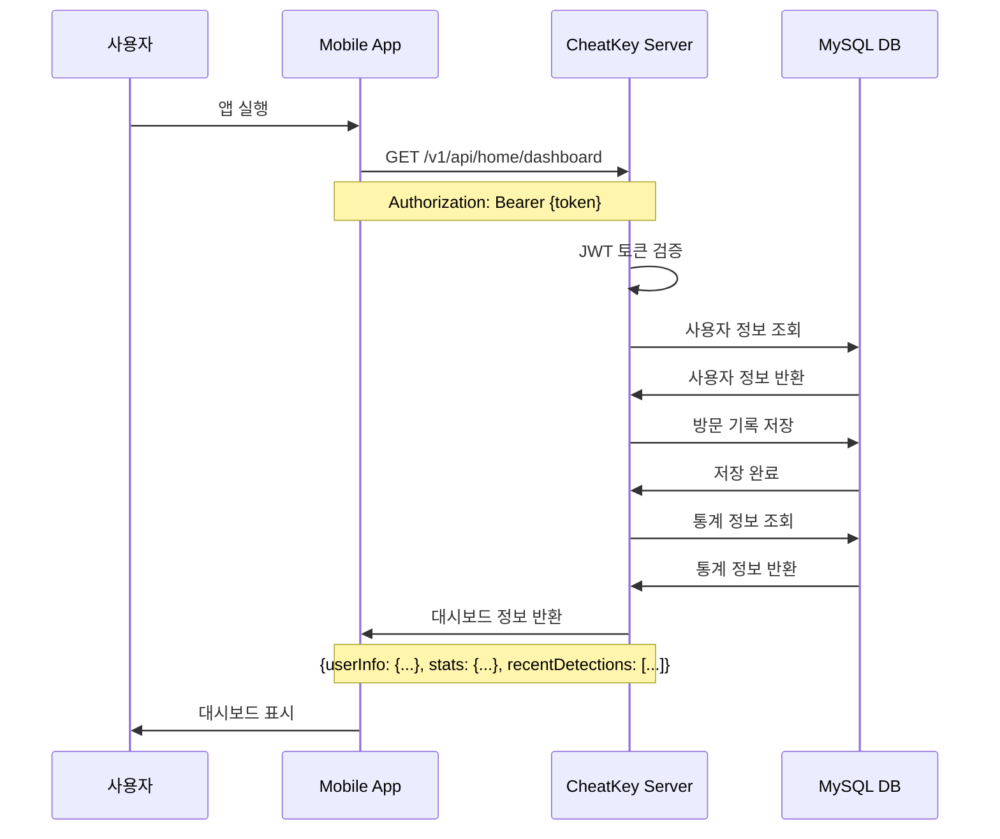

### 4.2 마이페이지 조회

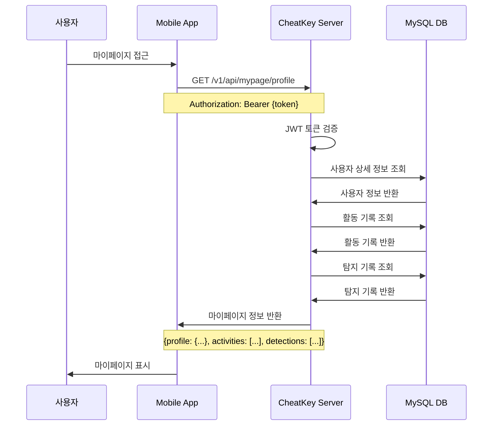

## 5. 에러 처리 시퀀스

### 5.1 토큰 만료 처리

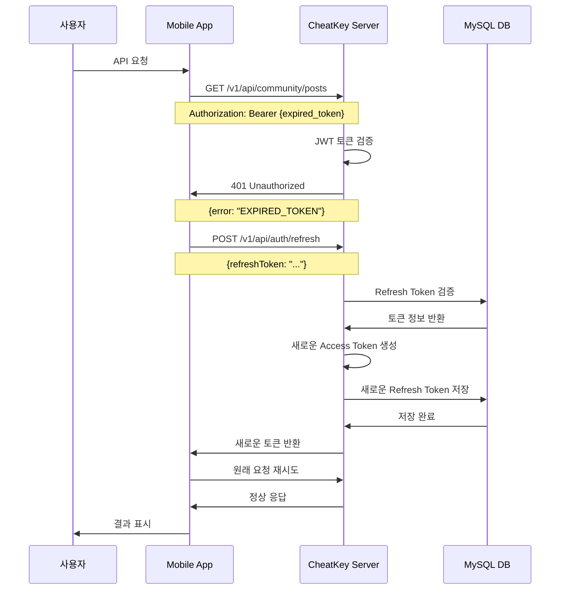

## 6. 성능 최적화 시퀀스

### 6.1 페이징을 활용한 게시글 조회

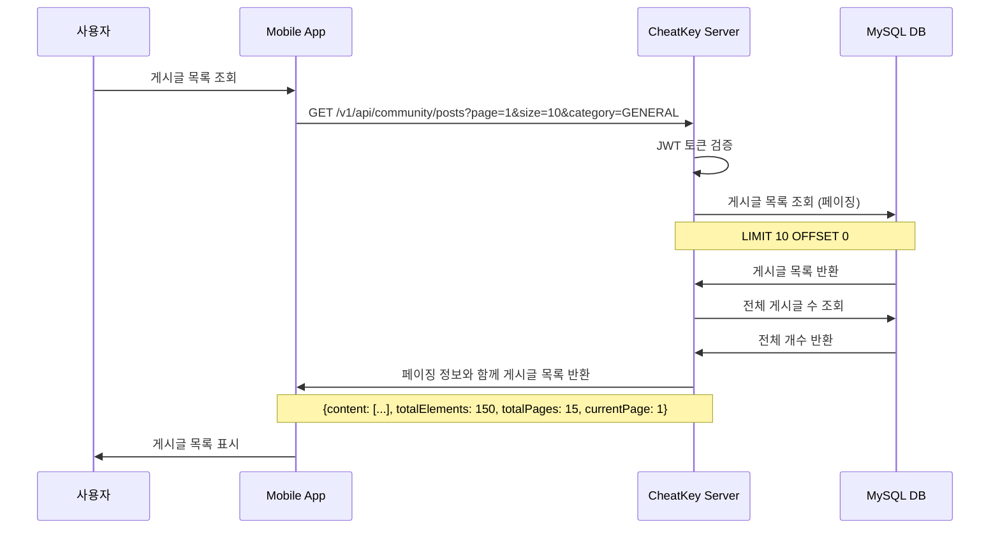

### 6.2 인덱스를 활용한 검색 최적화

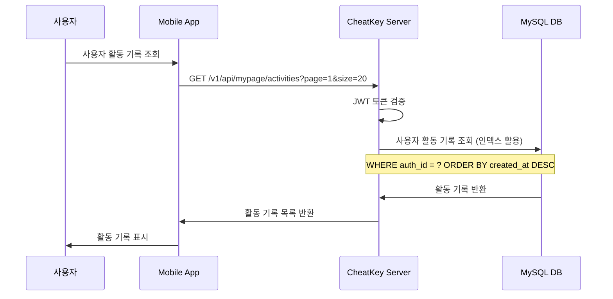