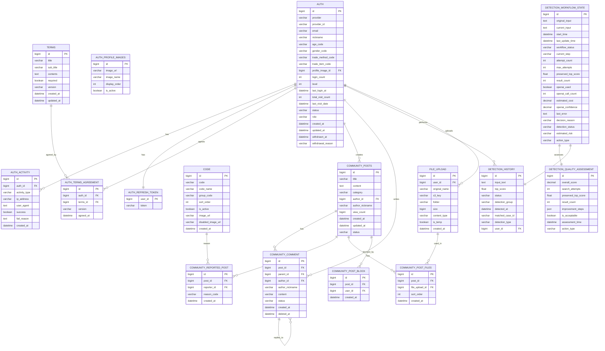

# CheatKey ERD (Entity Relationship Diagram)

## 1. 전체 ERD 구조



## 2. 테이블별 상세 스키마

### 2.1 인증 관련 테이블

#### t_auth (사용자 인증 정보)
```sql
CREATE TABLE t_auth (
    id BIGINT PRIMARY KEY AUTO_INCREMENT,
    provider VARCHAR(20) NOT NULL,                    -- PROVIDER enum (KAKAO, APPLE)
    provider_id VARCHAR(255) NOT NULL,                -- 소셜 제공자 ID
    email VARCHAR(255),                               -- 이메일
    nickname VARCHAR(50),                             -- 닉네임
    age_code VARCHAR(200),                            -- AGE_CODE enum → t_code.group_code='AGE_GROUP'
    gender_code VARCHAR(200),                         -- GENDER_CODE enum → t_code.group_code='GENDER'
    trade_method_code VARCHAR(200),                   -- TRADE_METHOD_CODE enum → t_code.group_code='TRADE_METHOD'
    trade_item_code VARCHAR(200),                     -- TRADE_ITEM_CODE enum → t_code.group_code='TRADE_ITEM'
    profile_image_id BIGINT,                          -- 프로필 이미지 ID
    login_count INT DEFAULT 0,                        -- 로그인 횟수
    level INT DEFAULT 1,                              -- 사용자 레벨
    last_login_at DATETIME,                           -- 마지막 로그인 시간
    total_visit_count INT DEFAULT 0,                  -- 총 방문 횟수
    last_visit_date DATETIME,                         -- 마지막 방문 날짜
    status VARCHAR(20) DEFAULT 'PENDING',             -- AUTH_STATUS enum (PENDING, ACTIVE, WITHDRAWN)
    role VARCHAR(20) DEFAULT 'USER',                  -- AUTH_ROLE enum (USER, ADMIN)
    created_at DATETIME DEFAULT CURRENT_TIMESTAMP,
    updated_at DATETIME DEFAULT CURRENT_TIMESTAMP ON UPDATE CURRENT_TIMESTAMP,
    withdrawn_at DATETIME,                            -- 탈퇴 시점
    withdrawal_reason VARCHAR(500),                   -- 탈퇴 사유 (→ t_code.group_code='WITHDRAWAL_REASON')
    
    UNIQUE KEY uk_provider_provider_id (provider, provider_id),
    INDEX idx_email (email),
    INDEX idx_nickname (nickname)
);
```

#### t_auth_activity (사용자 활동 기록)
```sql
CREATE TABLE t_auth_activity (
    id BIGINT PRIMARY KEY AUTO_INCREMENT,
    auth_id BIGINT NOT NULL,
    activity_type VARCHAR(50) NOT NULL,               -- ACTIVITY_TYPE enum (SOCIAL_LOGIN, TOKEN_REFRESH, HOME_VISIT, MYPAGE_VISIT, REACTIVATION_ATTEMPT, USER_WITHDRAWAL)
    ip_address VARCHAR(45),                           -- IP 주소
    user_agent TEXT,                                  -- User Agent
    success BOOLEAN DEFAULT TRUE,                     -- 성공 여부
    fail_reason TEXT,                                 -- 실패 사유
    created_at DATETIME DEFAULT CURRENT_TIMESTAMP,
    
    FOREIGN KEY (auth_id) REFERENCES t_auth(id) ON DELETE CASCADE,
    INDEX idx_auth_id (auth_id),
    INDEX idx_activity_type (activity_type),
    INDEX idx_created_at (created_at)
);
```

#### t_auth_refresh_token (리프레시 토큰)
```sql
CREATE TABLE t_auth_refresh_token (
    user_id BIGINT PRIMARY KEY,
    token VARCHAR(500) NOT NULL UNIQUE,
    
    FOREIGN KEY (user_id) REFERENCES t_auth(id) ON DELETE CASCADE
);
```

#### t_auth_profile_images (프로필 이미지)
```sql
CREATE TABLE t_auth_profile_images (
    id BIGINT PRIMARY KEY AUTO_INCREMENT,
    image_url VARCHAR(500),
    image_name VARCHAR(255),
    display_order INT DEFAULT 0,
    is_active BOOLEAN DEFAULT TRUE
);
```

### 2.2 약관 관련 테이블

#### t_terms (약관 정보)
```sql
CREATE TABLE t_terms (
    id BIGINT PRIMARY KEY AUTO_INCREMENT,
    title VARCHAR(255) NOT NULL,
    sub_title VARCHAR(255),
    contents TEXT NOT NULL,
    required BOOLEAN DEFAULT FALSE,
    version VARCHAR(20),
    created_at DATETIME DEFAULT CURRENT_TIMESTAMP,
    updated_at DATETIME DEFAULT CURRENT_TIMESTAMP ON UPDATE CURRENT_TIMESTAMP,
    
    INDEX idx_version (version),
    INDEX idx_required (required)
);
```

#### t_auth_terms_agreement (약관 동의 기록)
```sql
CREATE TABLE t_auth_terms_agreement (
    id BIGINT PRIMARY KEY AUTO_INCREMENT,
    auth_id BIGINT NOT NULL,
    terms_id BIGINT NOT NULL,
    version VARCHAR(20),
    agreed_at DATETIME DEFAULT CURRENT_TIMESTAMP,
    
    FOREIGN KEY (auth_id) REFERENCES t_auth(id) ON DELETE CASCADE,
    FOREIGN KEY (terms_id) REFERENCES t_terms(id) ON DELETE CASCADE,
    UNIQUE KEY uk_auth_terms (auth_id, terms_id),
    INDEX idx_auth_id (auth_id),
    INDEX idx_terms_id (terms_id)
);
```

### 2.3 코드 관리 테이블

#### t_code (코드 관리)
```sql
CREATE TABLE t_code (
    id BIGINT PRIMARY KEY AUTO_INCREMENT,
    code VARCHAR(50) NOT NULL,
    code_name VARCHAR(100) NOT NULL,
    group_code VARCHAR(50) NOT NULL,                  -- CODE_TYPE enum
    sort_order INT DEFAULT 0,
    is_active BOOLEAN DEFAULT TRUE,
    image_url VARCHAR(500),
    disabled_image_url VARCHAR(500),
    created_at DATETIME DEFAULT CURRENT_TIMESTAMP,
    
    UNIQUE KEY uk_code (code),
    INDEX idx_group_code (group_code),
    INDEX idx_sort_order (sort_order)
);
```

### 2.4 커뮤니티 관련 테이블

#### t_community_posts (커뮤니티 게시글)
```sql
CREATE TABLE t_community_posts (
    id BIGINT PRIMARY KEY AUTO_INCREMENT,
    title VARCHAR(255) NOT NULL,
    content TEXT NOT NULL,
    category VARCHAR(50) NOT NULL,                    -- 커뮤니티 카테고리 (자유게시판, 공지사항 등 - 현재는 t_code 미사용)
    author_id BIGINT NOT NULL,                        -- 작성자 ID (user_id → author_id로 변경)
    author_nickname VARCHAR(50) NOT NULL,             -- 작성자 닉네임 (nickname → author_nickname으로 변경)
    view_count BIGINT DEFAULT 0,
    created_at DATETIME DEFAULT CURRENT_TIMESTAMP,
    updated_at DATETIME DEFAULT CURRENT_TIMESTAMP ON UPDATE CURRENT_TIMESTAMP,
    status VARCHAR(20) DEFAULT 'ACTIVE',              -- POST_STATUS enum (ACTIVE, DELETED, REPORTED)
    
    FOREIGN KEY (author_id) REFERENCES t_auth(id) ON DELETE CASCADE,
    INDEX idx_author_id (author_id),
    INDEX idx_category (category),
    INDEX idx_status (status),
    INDEX idx_created_at (created_at)
);
```

#### t_community_comment (커뮤니티 댓글)
```sql
CREATE TABLE t_community_comment (
    id BIGINT PRIMARY KEY AUTO_INCREMENT,
    post_id BIGINT NOT NULL,
    parent_id BIGINT,                                 -- 대댓글인 경우 부모 댓글 ID
    author_id BIGINT NOT NULL,                        -- 작성자 ID (user_id → author_id로 변경)
    author_nickname VARCHAR(50) NOT NULL,             -- 작성자 닉네임 (user_nickname → author_nickname으로 변경)
    content VARCHAR(200) NOT NULL,
    status VARCHAR(10) DEFAULT 'ACTIVE',              -- COMMENT_STATUS enum (ACTIVE, DELETED)
    
    created_at DATETIME DEFAULT CURRENT_TIMESTAMP,
    deleted_at DATETIME,
    
    FOREIGN KEY (post_id) REFERENCES t_community_posts(id) ON DELETE CASCADE,
    FOREIGN KEY (parent_id) REFERENCES t_community_comment(id) ON DELETE CASCADE,
    FOREIGN KEY (author_id) REFERENCES t_auth(id) ON DELETE CASCADE,
    INDEX idx_post_id (post_id),
    INDEX idx_parent_id (parent_id),
    INDEX idx_author_id (author_id),
    INDEX idx_status (status)
);
```

#### t_community_reported_post (신고된 게시글)
```sql
CREATE TABLE t_community_reported_post (
    id BIGINT PRIMARY KEY AUTO_INCREMENT,
    post_id BIGINT NOT NULL,
    reporter_id BIGINT NOT NULL,
    reason_code VARCHAR(50) NOT NULL,                 -- t_code.code 참조 (group_code='REPORT')
    created_at DATETIME DEFAULT CURRENT_TIMESTAMP,
    
    FOREIGN KEY (post_id) REFERENCES t_community_posts(id) ON DELETE CASCADE,
    FOREIGN KEY (reporter_id) REFERENCES t_auth(id) ON DELETE CASCADE,
    FOREIGN KEY (reason_code) REFERENCES t_code(code),
    INDEX idx_post_id (post_id),
    INDEX idx_reporter_id (reporter_id),
    INDEX idx_reason_code (reason_code)
);
```

#### t_community_post_files (게시글 첨부파일)
```sql
CREATE TABLE t_community_post_files (
    id BIGINT PRIMARY KEY AUTO_INCREMENT,
    post_id BIGINT NOT NULL,
    file_upload_id BIGINT NOT NULL,
    sort_order INT DEFAULT 0,
    created_at DATETIME DEFAULT CURRENT_TIMESTAMP,
    
    FOREIGN KEY (post_id) REFERENCES t_community_posts(id) ON DELETE CASCADE,
    FOREIGN KEY (file_upload_id) REFERENCES t_file_upload(id) ON DELETE CASCADE,
    INDEX idx_post_id (post_id),
    INDEX idx_sort_order (sort_order)
);
```

#### t_community_post_block (게시글 차단)
```sql
CREATE TABLE t_community_post_block (
    id BIGINT PRIMARY KEY AUTO_INCREMENT,
    post_id BIGINT NOT NULL,
    user_id BIGINT NOT NULL,
    created_at DATETIME DEFAULT CURRENT_TIMESTAMP,
    
    FOREIGN KEY (post_id) REFERENCES t_community_posts(id) ON DELETE CASCADE,
    FOREIGN KEY (user_id) REFERENCES t_auth(id) ON DELETE CASCADE,
    UNIQUE KEY uk_post_user (post_id, user_id),
    INDEX idx_post_id (post_id),
    INDEX idx_user_id (user_id)
);
```

### 2.5 사기 탐지 관련 테이블

#### t_detection_history (탐지 기록) - 현재 운영 중
```sql
CREATE TABLE t_detection_history (
    id BIGINT PRIMARY KEY AUTO_INCREMENT,
    input_text TEXT NOT NULL,
    top_score FLOAT NOT NULL,
    status VARCHAR(20) NOT NULL,                      -- DETECTION_STATUS enum (SAFE, WARNING, DANGER, UNKNOWN)
    detection_group VARCHAR(20),                      -- DETECTION_GROUP enum (NORMAL, PHISHING)
    detected_at DATETIME DEFAULT CURRENT_TIMESTAMP,
    matched_case_id VARCHAR(255),                     -- Qdrant 검색 결과 Top1의 ID
    detection_type VARCHAR(50),                       -- DETECTION_TYPE enum (TRANSACTION, INVESTMENT, PHISHING, IMPERSONATION)
    user_id BIGINT,                                   -- nullable (ON DELETE SET NULL)
    
    FOREIGN KEY (user_id) REFERENCES t_auth(id) ON DELETE SET NULL,
    INDEX idx_user_id (user_id),
    INDEX idx_status (status),
    INDEX idx_detection_type (detection_type),
    INDEX idx_detection_group (detection_group),
    INDEX idx_detected_at (detected_at)
);
```

#### t_detection_workflow_state (탐지 워크플로우 상태) - 고도화 진행 중
```sql
CREATE TABLE t_detection_workflow_state (
    id BIGINT PRIMARY KEY AUTO_INCREMENT,
    
    -- 기본 정보
    original_input TEXT NOT NULL,                     -- 원본 입력 텍스트
    current_input TEXT NOT NULL,                      -- 현재 처리 중인 입력 텍스트
    start_time DATETIME NOT NULL,                     -- 워크플로우 시작 시간
    last_update_time DATETIME NOT NULL,               -- 마지막 업데이트 시간
    
    -- 워크플로우 상태
    workflow_status VARCHAR(30) NOT NULL,             -- INITIALIZED, INPUT_VALIDATING, SEARCHING, QUALITY_ASSESSING, DECISION_MAKING, COMPLETED, FAILED, NEEDS_HUMAN_INTERVENTION
    current_step VARCHAR(30) NOT NULL,                -- BASIC_VALIDATION, OPENAI_VALIDATION, VECTOR_SEARCH, QUALITY_EVALUATION, RESULT_ANALYSIS, FINAL_DECISION
    attempt_count INT DEFAULT 0,                      -- 시도 횟수
    max_attempts INT DEFAULT 3,                       -- 최대 시도 횟수
    
    -- 검색 결과
    preserved_top_score FLOAT DEFAULT 0.0,            -- 백터 검색 점수 보존 (2단계에서 설정)
    result_count INT DEFAULT 0,                       -- 검색 결과 수
    
    -- OpenAI 사용 현황
    openai_used BOOLEAN DEFAULT FALSE,                -- OpenAI 사용 여부
    openai_call_count INT DEFAULT 0,                  -- OpenAI 호출 횟수
    estimated_cost DECIMAL(10,6) DEFAULT 0.0,         -- 예상 비용
    openai_confidence DECIMAL(3,2) DEFAULT 0.0,       -- OpenAI 검증 신뢰도
    
    -- 에러 및 로그
    last_error TEXT,                                  -- 마지막 오류
    
    -- 의사결정 정보
    decision_reason VARCHAR(50),                      -- 의사결정 사유
    detection_status VARCHAR(20),                     -- 최종 판단 결과 (SAFE, WARNING, DANGER, UNKNOWN)
    
    -- 위험도 및 공유 정보
    estimated_risk VARCHAR(20),                       -- 예상 위험도 (LOW, MEDIUM, HIGH)
    action_type VARCHAR(30),                          -- 액션 타입
    
    INDEX idx_workflow_status (workflow_status),
    INDEX idx_current_step (current_step),
    INDEX idx_start_time (start_time),
    INDEX idx_detection_status (detection_status)
);
```

#### t_detection_quality_assessment (품질 평가) - 고도화 진행 중
```sql
CREATE TABLE t_detection_quality_assessment (
    id BIGINT PRIMARY KEY AUTO_INCREMENT,
    
    -- 품질 점수
    overall_score DECIMAL(3,1) NOT NULL,              -- AI 분석 결과의 전반적인 품질 점수 (0.0~10.0)
    
    -- 검색 관련 정보
    search_attempts INT DEFAULT 0,                    -- 검색 시도 횟수
    preserved_top_score FLOAT DEFAULT 0.0,            -- 백터 검색 점수 (0.0~1.0)
    result_count INT DEFAULT 0,                       -- 검색 결과 수
    improvement_steps JSON,                           -- 개선 단계들 (JSON 배열)
    
    -- 판정 결과
    is_acceptable BOOLEAN NOT NULL,                   -- 판정 결과의 신뢰성 여부
    assessment_time DATETIME NOT NULL,                -- 평가 시간
    action_type VARCHAR(30),                          -- 행동 지침
    
    INDEX idx_overall_score (overall_score),
    INDEX idx_is_acceptable (is_acceptable),
    INDEX idx_assessment_time (assessment_time)
);
```

### 2.6 파일 업로드 테이블

#### t_file_upload (파일 업로드)
```sql
CREATE TABLE t_file_upload (
    id BIGINT PRIMARY KEY AUTO_INCREMENT,
    user_id BIGINT NOT NULL,
    original_name VARCHAR(255) NOT NULL,
    s3_key VARCHAR(500) NOT NULL,
    folder VARCHAR(50) NOT NULL,                      -- FILE_FOLDER enum (COMMUNITY, PROFILE 등 - 현재는 t_code 미사용)
    size BIGINT NOT NULL,
    content_type VARCHAR(100) NOT NULL,
    is_temp BOOLEAN DEFAULT TRUE,
    created_at DATETIME DEFAULT CURRENT_TIMESTAMP,
    
    FOREIGN KEY (user_id) REFERENCES t_auth(id) ON DELETE CASCADE,
    INDEX idx_user_id (user_id),
    INDEX idx_folder (folder),
    INDEX idx_is_temp (is_temp),
    INDEX idx_created_at (created_at)
);
```

## 3. 백업 및 복구 전략

### 3.1 현재 운영 환경 (베타 서비스 단계)
- **RDS**: Single-AZ 설정으로 현재 부하에 충분
- **백업**: AWS RDS 자동 백업 기능만 활용
  - 자동 백업 스토리지는 RDS 인스턴스 스토리지 용량과 동일한 크기까지 무료 제공 (초과 시 과금 발생)
  - 보관 기간은 기본 7일로 설정
- **복구**: RDS 자동 백업 기반의 Point-in-Time Recovery(PITR)까지만 지원

### 3.2 향후 확장 계획 (정식 서비스 단계)
- **Multi-AZ RDS**: 고가용성 강화
- **Auto Scaling Groups**: 트래픽 증가 시 자동 확장
- **RDS Read Replicas**: 읽기 부하 분산 및 가용성 향상
- **Application Load Balancer (ALB)**: 다중 서버 환경 대응

### 3.3 백업 전략 (향후 계획)
- **일일 전체 백업**: 서비스 안정화 및 데이터 중요도 증가 시 도입 예정
- **증분 백업**: 시간별 증분 백업 전략 도입 예정
- **로그 백업**: 실시간 트랜잭션 로그 백업 전략 도입 예정

### 3.4 복구 전략 (향후 계획)
- **RTO/RPO 목표 정의**: 정식 서비스 단계에서 수립 예정
- **다중 AZ 기반 DR**: Disaster Recovery 절차 수립 예정
- **데이터 무결성 검증**: 복구 후 정상 동작 여부 확인

## 4. 정규화 설계 원칙

### 4.1 정규화 기준
CheatKey의 데이터 모델은 전반적으로 **3정규형(3NF)**을 기준으로 설계되었으며, 주요 기준은 다음과 같습니다:

- **도메인별 분리**: `AUTH`, `TERMS`, `CODE` 테이블은 각각의 도메인에 따라 분리하여 중복 제거
- **이벤트 중심 설계**: `AUTH_ACTIVITY`, `AUTH_TERMS_AGREEMENT`, `FILE_UPLOAD` 등은 이벤트/기록 중심 테이블로 **일대다 관계를 보장**
- **계층형 구조**: `COMMUNITY_COMMENT`는 계층형 구조를 지원하기 위해 **self-referencing FK (parent_id)** 구조 사용
- **사용자 독립성**: `DETECTION_HISTORY`는 사용자 의존적이지 않도록 `user_id`를 **nullable**로 설정
- **데이터 무결성**: 커뮤니티 테이블에서 **닉네임 중복 저장**은 사용자 정보 변경 시에도 과거 게시글/댓글의 작성자 정보가 유지되도록 설계
- **JPA 기반 설계**: 모든 엔티티는 JPA 어노테이션을 통해 제약조건 및 관계를 정의

### 4.2 성능 최적화
- **인덱스 전략**: 자주 조회되는 컬럼들에 대한 인덱스 최적화
- **비정규화**: 읽기 성능 향상을 위해 필요한 부분에서 적절한 비정규화 적용
- **커버링 인덱스**: SELECT 절의 모든 컬럼을 포함하는 인덱스 활용

### 4.3 데이터 무결성 보장
- **JPA 기반 검증**: `@Enumerated(EnumType.STRING)`으로 enum 값 검증
- **Spring Boot Validation**: 애플리케이션 레벨에서 데이터 무결성 보장
- **외래키 제약조건**: FK를 통한 참조 무결성 보장
- **NOT NULL 제약조건**: 필수 데이터 보장

### 4.4 JPA 특화 설계
- **엔티티 관계**: `@OneToMany`, `@ManyToOne`, `@OneToOne` 등 JPA 관계 매핑 활용
- **지연 로딩**: `FetchType.LAZY`를 통한 성능 최적화
- **캐스케이드**: 적절한 `CascadeType` 설정으로 데이터 무결성 보장
- **트랜잭션 관리**: `@Transactional`을 통한 데이터 일관성 보장

### 4.5 코드 테이블 활용 전략
- **중앙 집중식 코드 관리**: `t_code` 테이블을 통한 핵심 enum 값 관리
- **group_code 기반 분류**: `AGE_GROUP`, `GENDER`, `TRADE_METHOD`, `TRADE_ITEM`, `REPORT`, `WITHDRAWAL_REASON` 등
- **실제 사용 패턴**: `codeService.getOptionsByType(CodeType.REPORT)` 형태로 사용
- **확장성**: 새로운 코드 추가 시 `CodeType` enum과 `t_code` 테이블에 동시 추가
- **일관성**: 애플리케이션 레벨에서 코드 값 검증 및 관리

→ 정규화 기반 설계를 유지하면서, JPA의 장점을 활용한 효율적인 데이터 모델링이 적용되었습니다. 